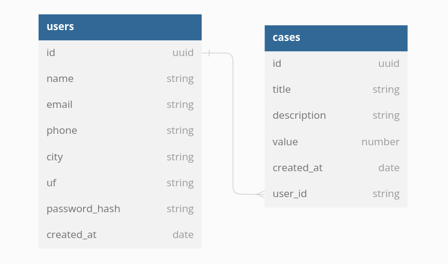

# How to run

<ol>
<li>
Clone the app:

```
git clone https://github.com/daniel-souza01/be-the-hero_backend.git
```

</li>

<li>
Install all dependencies:

```
yarn
or
npm install
```

</li>

<li>

Copy `.env.example` to `.env` .

</li>

<li>
Create and start the docker container:

```
docker-compose up
```

</li>

<li>
Generate prisma client:

```
npx prisma generate
```

</li>

<li>
Run the migrations:

```
npx prisma migrate dev
```

</li>

<li>
Run application:

```
npm run start:dev

```

</li>
</ol>

# Diagram



---
